# 寻找A4纸所在的四边形区域与变形-数字识别专题

 

## 概要

本次课程， 阿凯带大家从一张带由背景的图片中，提取其中A4纸的区域， 并对其所在的多边形区域进行透视变换，变换成规则的矩形，并单独提取出来。

## 任务描述

为了极大还原图像预处理的整个过程，我拍了如下图片。

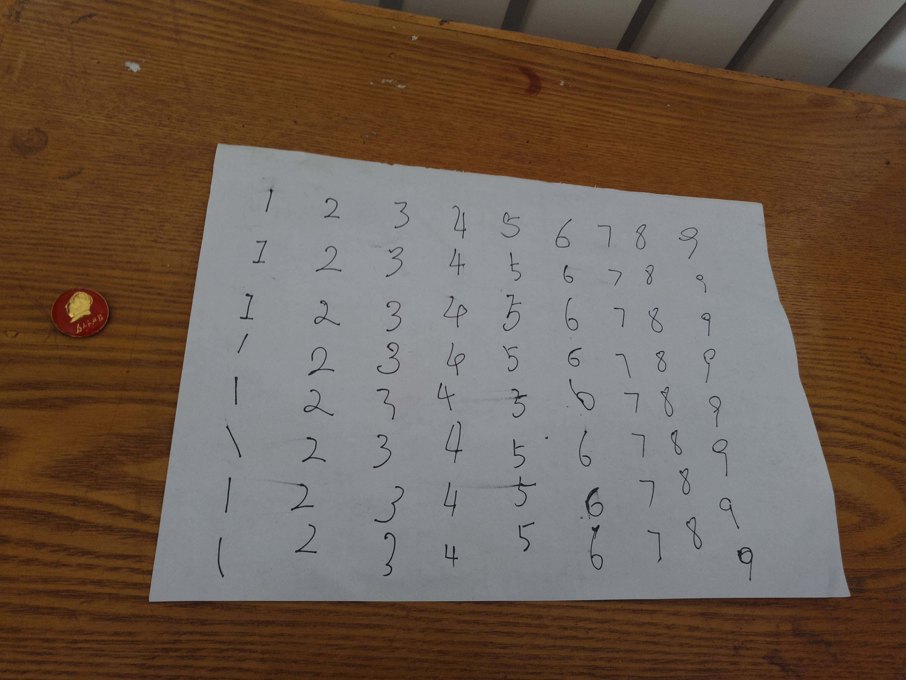

手写了若干个数字，且相邻字符之间没有交点。

设置了如下障碍：

1. 有背景干扰， 有我的小书桌， 也由暖气片， 也由毛主席徽章。

   且因为背景是木桌，木质条纹有较多干扰。

2. 摄像头位置没有拍正， A4纸张并不是标准的矩形。

3. 光线比较暗， 背景与数字的对比度降低了。

4. 噪声， 阿凯故意用手擦了一下油墨， 画面有墨迹。

5. A4纸张并非为标准的四边形，局部有轻微翘起， 顶部还有轻微的撕痕。


你需要将图中的矩形区域提取出来。

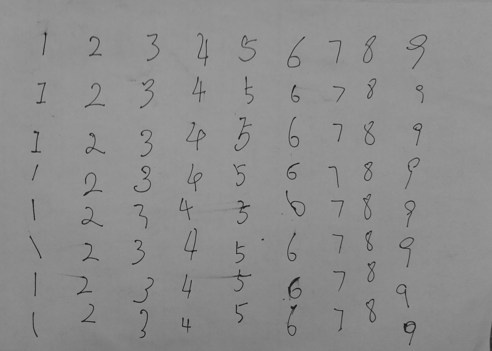


## 1 求得图像边缘

我们首先使用canny算子对原图像求得边缘。


```python
# 读入图片
gray = cv2.imread('./raw_numbers_img.jpg', cv2.IMREAD_GRAYSCALE)
# 中值滤波 过滤噪声，保留边缘信息
gray = cv2.medianBlur(gray,5) 
# Canny算子求得图像边缘
edges = cv2.Canny(gray, 50, 150, apertureSize = 3)
```


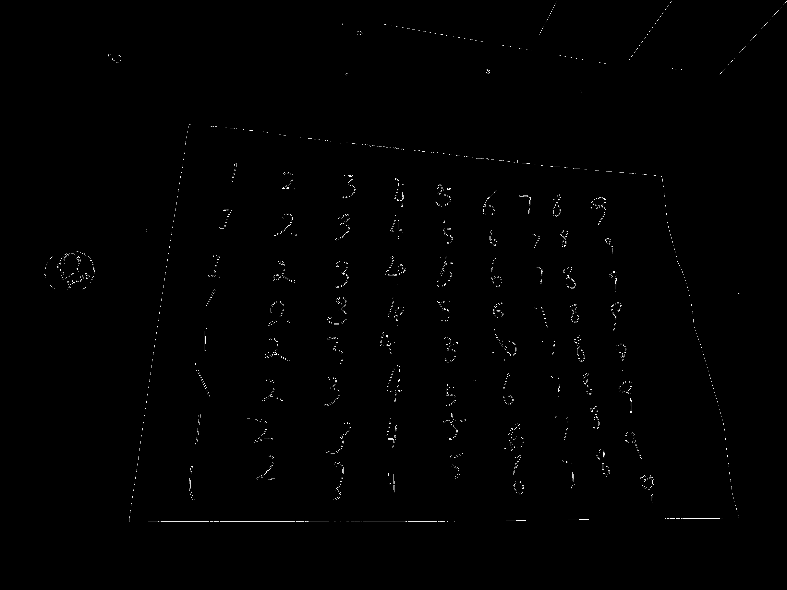


## 2 数学形态学修补破损边缘

如果你放大图片之后， 就会发现， 边缘并不光滑，有很多边缘碎片。所以我们需要使用**数学形态学**的方法，将其连接在一起。

> 复习 CH4.5_数学形态学-

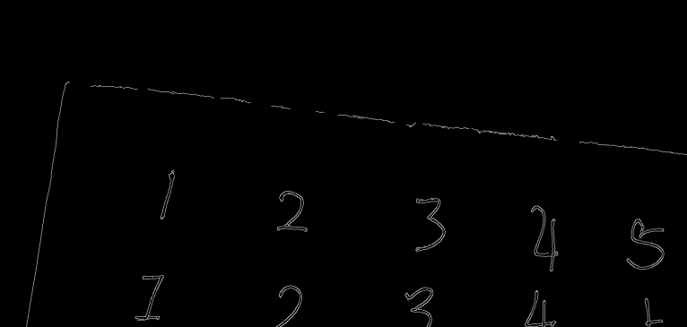


因为提取的是A4纸的边缘， 面积比较大，所以可以采用稍微粗暴一些的方式。


采用**9*9**结构元(Sturcture Element), 疯狂膨胀。


```python
# 定义一个9×9的十字形状的结构元
kernel = cv2.getStructuringElement(cv2.MORPH_CROSS,(9,9))
# 重复膨胀 迭代10次
edges = cv2.dilate(edges, kernel, iterations=10)

```


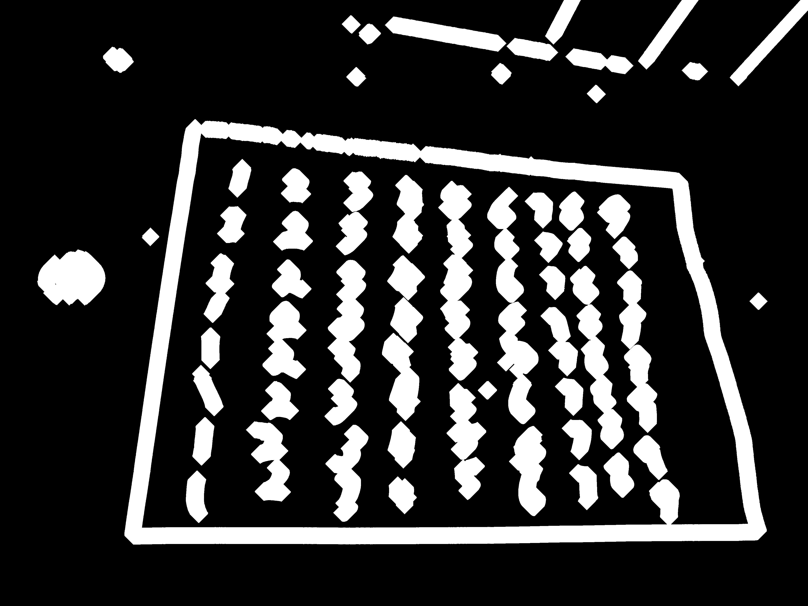


可以看到相关元素都连接在一起了，没有裂缝。


## 3 寻找A4纸对应的contour

根据连通域的尺寸进行过滤， 找到面积最大的即为A4纸对应的contour。

注意，因为我们只关注最外层的边缘，所以采用的是`cv2.RETR_EXTERNAL` 。

> 模式之间不同， 参见: CH5.1_获取边缘点集与绘制-

```python
# 寻找轮廓
bimg, contours, hier = cv2.findContours(edges, cv2.RETR_EXTERNAL, cv2.CHAIN_APPROX_SIMPLE)
# 获取面积最大的contour
cnt = max(contours, key=lambda cnt: cv2.contourArea(cnt))
```

将其可视化，绘制到画布上。


```python
edges_filter = np.zeros_like(gray)
cv2.drawContours(edges_filter, [cnt], 0, (255), 3)
cv2.imwrite('number-edge-filter.png', edges_filter)
```


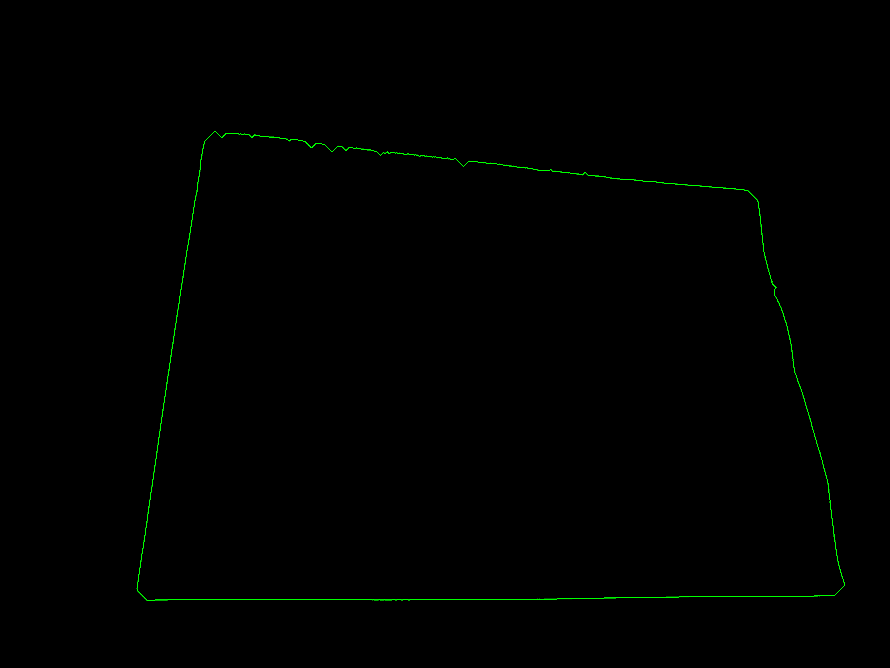

当然，因为我们用的是膨胀算法，得到的边缘要比实际的大一圈。我们在后面的投影变换的过程中会有所修正。


## 4 用直线逼近多边形

> **注意** 这个方法由于素材的特性最后没有采用， 但是阿凯觉得，走过的弯路也可以给大家一些参考

获取了边缘的边缘之后，本来想识别四条直线，然后求得角点来者，无奈，因为纸张有翘起，所以并不是理想的平整。边缘有波浪线跟锯齿。

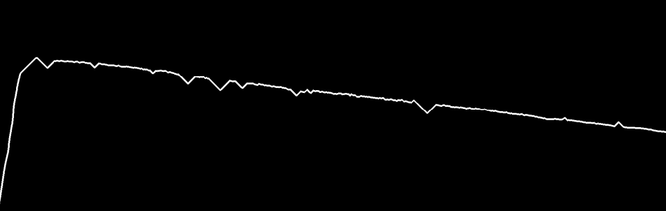


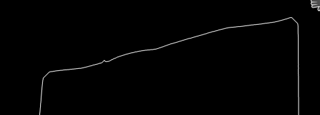

不过你也可以自己实验一下这种方法， 例如将过滤得到的直线分成四组， 然后每组内求个平均。


```python
# 定义一个二值图
edges_filter = np.zeros_like(gray)
# 用白线绘制边缘
cv2.drawContours(edges_filter, [cnt], 0, (255), 3)
# cv2.imwrite('number-edge-filter.png', edges_filter)
# 霍夫变换，寻找直线
# 需要调整阈值才能达到想要的效果
lines = cv2.HoughLines(edges_filter, 6, np.pi/90, 500)
```

PS：你需要对霍夫变换有一定的了解才能懂得其中参数对应的含义。 我后面会写霍夫变换寻找直线的教程。之前写过圆形识别的教程，希望对你有所帮助。

[霍夫变换识别圆形-阿凯带你玩转计算机视觉](http://book.myopenmv.com/example/feature/circle-detection.html)


接下来在画布中绘制直线。

```python
# 定义画布
canvas = cv2.cvtColor(edges_filter, cv2.COLOR_GRAY2BGR)
# 获取画布尺寸
height,width,_ = canvas.shape

for line in lines:
    rho = line[0][0] #第一个元素是距离rho  
    theta= line[0][1] #第二个元素是角度theta  
    print(rho)
    print(theta)  
    if  (theta < (np.pi/4. )) or (theta > (3.*np.pi/4.0)): #垂直直线  
                #该直线与第一行的交点  
        pt1 = (int(rho/np.cos(theta)),0)  
        #该直线与最后一行的交点  
        pt2 = (int((rho-height*np.sin(theta))/np.cos(theta)),height)  
        #绘制一条绿线  
        cv2.line(canvas, pt1, pt2, (0, 255, 0), 4)  
    else: #水平直线  
        # 该直线与第一列的交点  
        pt1 = (0,int(rho/np.sin(theta)))  
        #该直线与最后一列的交点  
        pt2 = (width, int((rho-width*np.cos(theta))/np.sin(theta)))  
        #绘制一条直线  
        cv2.line(canvas, pt1, pt2, (0,0,255), 4)  
```

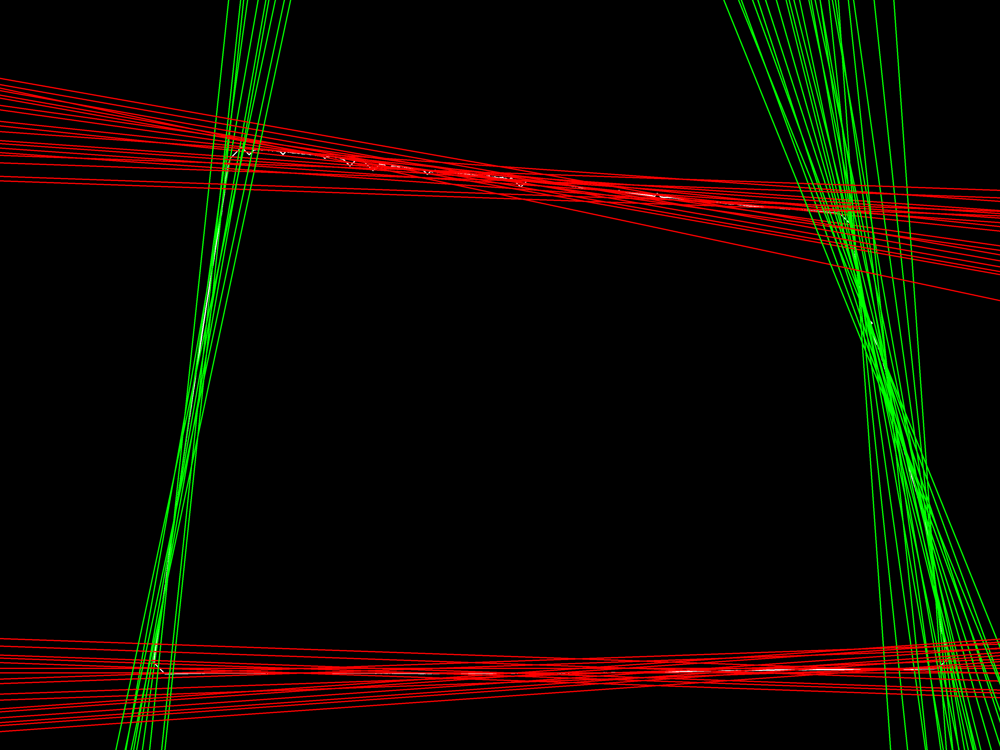

嗯，接下来，看同学们自己折腾啦。


## 5 多边形近似

后面这个问题的解决， 我用了一种比较简单方便的方法。 调用了opencv中自带的**approxPolyDP** 函数。

```python
# 多变形近似
epsilon = 0.1*cv2.arcLength(cnt,True)
# 返回点集，格式与contours相同
approx = cv2.approxPolyDP(cnt,epsilon,True)
```

将`approx`打印出来 

```
[[[ 922  632]]

 [[ 659 2694]]

 [[3794 2630]]

 [[3362  857]]]

```

**将其可视化**

```python
cv2.drawContours(canvas, [approx], 0, (0, 255, 0), 10)
for point in approx:
    # 绘制多边形顶点
    cv2.circle(canvas,tuple(point[0]), 40, (0,255, 255), -1)
```

效果如下图所示

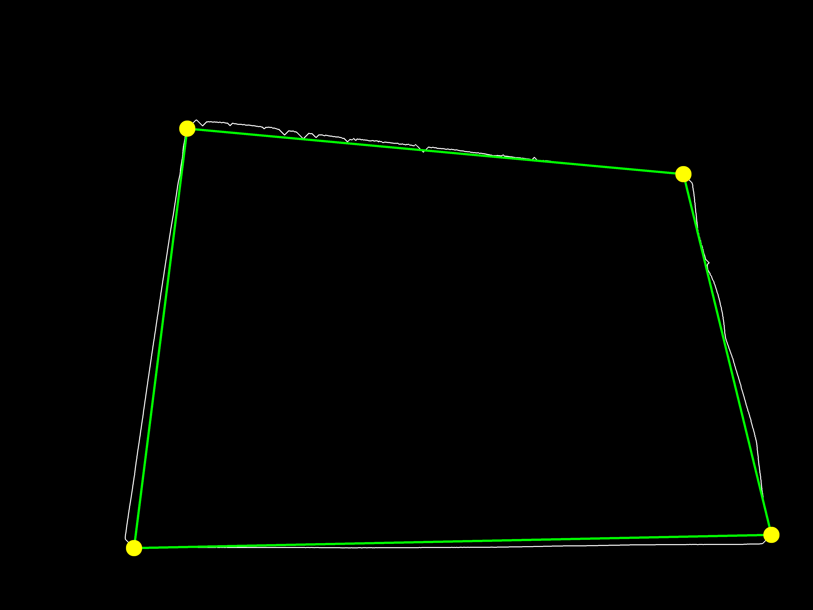


## 6 图像的透视变换 PerspectiveTransform

之前我们在 **CH5.3 图像2D仿射变换-** 里面讲解的是仿射变换**AffineTransform**。

那么透视变换与仿射变换之间最大的区别是什么呢？

**画面中两个平行的边，仿射变换过后，依然保持平行。** 三点可以确定一个变换。

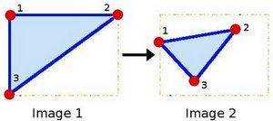

而透视变换则不一定，所以**可以将仿射变换作为投影变换的一个特例。** 需要四个点，才能确定透视变换。


举一个来自官网的例子

[Geometric Transformations of Images](https://docs.opencv.org/3.0-beta/doc/py_tutorials/py_imgproc/py_geometric_transformations/py_geometric_transformations.html#geometric-transformations)


```python
img = cv2.imread('sudokusmall.png')
rows,cols,ch = img.shape
# 左图中画面中的点的坐标 四个
pts1 = np.float32([[56,65],[368,52],[28,387],[389,390]])
# 变换到新图片中，四个点对应的新的坐标 一一对应
pts2 = np.float32([[0,0],[300,0],[0,300],[300,300]])

# 生成变换矩阵
M = cv2.getPerspectiveTransform(pts1,pts2)
# 进行透视变换
dst = cv2.warpPerspective(img,M,(300,300))

plt.subplot(121),plt.imshow(img),plt.title('Input')
plt.subplot(122),plt.imshow(dst),plt.title('Output')
plt.show()
```


之前我们获取了四边形的近似顶点。

```python
[[[ 922  632]]

 [[ 659 2694]]

 [[3794 2630]]

 [[3362  857]]]

```

同时，因为之前边缘处进行了膨胀，所以变换回去的时候， 可以内缩。

```python
# 因为之前膨胀了很多次，所以四边形区域需要向内收缩而且本身就有白色边缘
margin=40
pts1 = np.float32([[921+margin, 632+margin], [659+margin, 2695-margin], [3795-margin, 2630-margin], [3362-margin, 856+margin]])
```

A4纸的宽高比在 1.4 ： 1, 所以定义新图片的四个顶点。

```python
pts2 = np.float32([[0,0], [0, 1000], [1400, 1000], [1400, 0]])
```

```python
M = cv2.getPerspectiveTransform(pts1,pts2)
dst = cv2.warpPerspective(gray,M,(1400,1000))
```

最终得到了我们想要的图片。


## 拓展思考

文章中的多边形近似是直接调用的opencv中的多变形近似。我们有很多未解决的问题。


**如何过滤掉边缘中的锯齿型噪声？如何取平滑smoothing?**


**如何将曲线拉直，线形化  ? **


**opencv中多边形近似函数用的是什么算法？  还有没有其它多边形近似算法?**


## 作业 Homework 

### Task - 2.1.1

本次教程，阿凯采用的是提取边缘，然后识别矩形的方案。 你能不能将色彩空间变换到HSV，然后采用颜色阈值分割的方式提取A4纸的区域？

请回顾 **CH4_ROI颜色统计与图像二值化**中的相关章节。


## 附录-源代码

### `ContourApproximation.py`

```python
'''
多边形近似提取A4纸的多边形点集
（四边形近似）
'''
import numpy as np
import cv2


# 读入图片
gray = cv2.imread('./raw_numbers_img.jpg', cv2.IMREAD_GRAYSCALE)
# 中值滤波 过滤噪声，保留边缘信息
gray = cv2.medianBlur(gray,5) 
# Canny算子求得图像边缘
edges = cv2.Canny(gray, 50, 150, apertureSize = 3)

# 定义一个9×9的十字形状的结构元
kernel = cv2.getStructuringElement(cv2.MORPH_CROSS,(9,9))
# 重复膨胀 迭代10次
edges = cv2.dilate(edges, kernel, iterations=10)


# 寻找轮廓
bimg, contours, hier = cv2.findContours(edges, cv2.RETR_EXTERNAL, cv2.CHAIN_APPROX_SIMPLE)
# 获取面积最大的contour
cnt = max(contours, key=lambda cnt: cv2.contourArea(cnt))

edges_filter = np.zeros_like(gray)
cv2.drawContours(edges_filter, [cnt], 0, (255), 3)
cv2.imwrite('number-edge-filter.png', edges_filter)

# 多变形近似
epsilon = 0.1*cv2.arcLength(cnt,True)
approx = cv2.approxPolyDP(cnt,epsilon,True)


canvas = cv2.cvtColor(edges_filter, cv2.COLOR_GRAY2BGR)
height,width,_ = canvas.shape

# print(approx)
cv2.drawContours(canvas, [approx], 0, (0, 255, 0), 10)
for point in approx:
    # 绘制角点
    cv2.circle(canvas,tuple(point[0]), 40, (0,255, 255), -1)

cv2.namedWindow('Canny', flags=cv2.WINDOW_NORMAL | cv2.WINDOW_FREERATIO)
cv2.namedWindow('Result', flags=cv2.WINDOW_NORMAL | cv2.WINDOW_FREERATIO)
cv2.imshow('Canny', edges_filter )  
cv2.imshow('Result', canvas)

# cv2.imwrite('countour-approximation-corner-point.png', canvas)
cv2.waitKey(0)  
cv2.destroyAllWindows()  
```


###` perspective-transformation.py`


```python
'''
A4纸投影
'''

import cv2
import numpy as np


gray = cv2.imread('raw_numbers_img.jpg', cv2.IMREAD_GRAYSCALE)

# 因为之前膨胀了很多次，所以四边形区域需要向内收缩而且本身就有白色边缘
margin=40
pts1 = np.float32([[921+margin, 632+margin], [659+margin, 2695-margin], [3795-margin, 2630-margin], [3362-margin, 856+margin]])

pts2 = np.float32([[0,0], [0, 1000], [1400, 1000], [1400, 0]])

M = cv2.getPerspectiveTransform(pts1,pts2)
dst = cv2.warpPerspective(gray,M,(1400,1000))

cv2.imwrite('perpective-number.png', dst)
```

