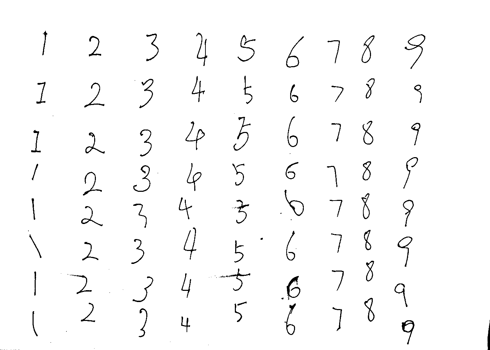
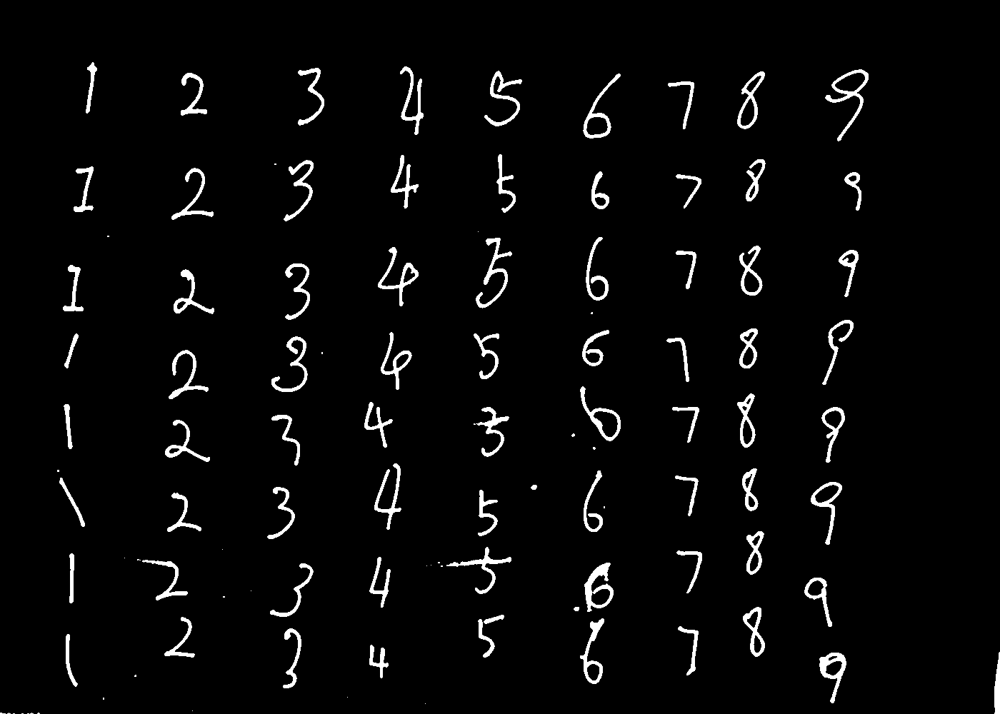
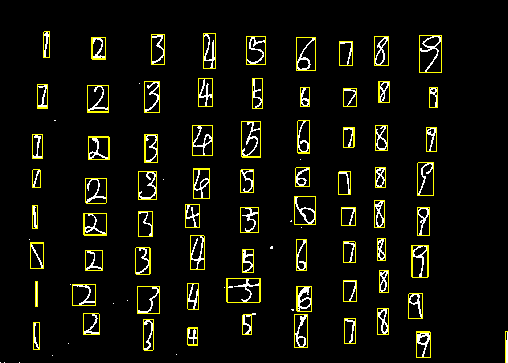
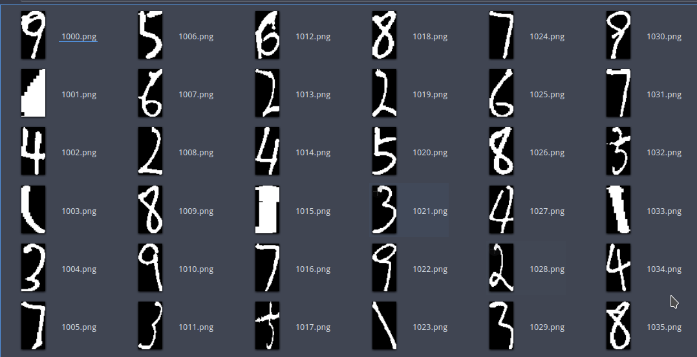
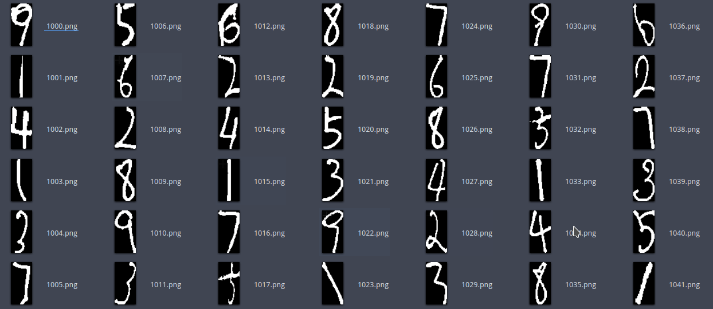

# 2.2_A4纸区域的图像二值化与数字提取


## 概要

本节， 阿凯教大家对数字图片进行二值化处理， 并通过数学形态学的方法， 获取了噪声较小的二值化图片。 接下来检索contours，提取含有数字的区域， 并统一放缩到特定尺寸。


##  1 二值化与数学形态学操作

在2.1中我们获取了如下图片

![./image/numbers_A4.png)


接下来，我们需要将其进行二值化。

根据我们hsv的阈值， 我们可以提取出来背景图片的二值化图片。

```python
# 载入图片
img = cv2.imread('numbers_A4.png')

lowerb = (0,0,116)
upperb = (255,255,255)
# 根据hsv阈值 进行二值化
back_mask = cv2.inRange(cv2.cvtColor(img, cv2.COLOR_BGR2HSV), lowerb, upperb)
```




一般我们称这种图片为后景图片，背景为逻辑1.

**为了让数字笔画（黑色区域）更加明显，笔画加粗**

我们首先需要对其腐蚀，推荐使用圆形的结构元。

接下来，将图像取反，变换为前景图片（背景为逻辑0）。为了去掉细小的噪声，对其进行中值滤波。


```python
# 形态学操作， 圆形核腐蚀
kernel = cv2.getStructuringElement(cv2.MORPH_ELLIPSE,(3,3))
back_mask = cv2.erode(back_mask, kernel, iterations=1)
# 反色 变为数字的掩模
num_mask = cv2.bitwise_not(back_mask)
# 中值滤波
num_mask = cv2.medianBlur(num_mask,3) 
```





## 2 检索contours

首先获取图片中的所有边缘点集 `contours`

```python
# 寻找轮廓
bimg, contours, hier = cv2.findContours(num_mask, cv2.RETR_EXTERNAL, cv2.CHAIN_APPROX_SIMPLE)
```


设定一些contour的过滤条件， 例如最小高度跟宽度。

```python
minWidth = 5 # 最小宽度
minHeight = 20 # 最小高度
```

然后通过设定的条件，过滤小的色块，获取数字所在的区域。

```python
base = 1000 # 计数编号
imgIdx = base # 当前图片的编号

# 检索满足条件的区域
for cidx,cnt in enumerate(contours):
    (x, y, w, h) = cv2.boundingRect(cnt)
    if w < minWidth or h < minHeight:
        # 如果不满足条件就过滤掉
        continue
    # 获取ROI图片
    digit = num_mask[y:y+h, x:x+w]
    digit = getStandardDigit(digit)

    cv2.imwrite('./digits_bin/{}.png'.format(imgIdx), digit)
    imgIdx+=1

    # 原图绘制圆形
    cv2.rectangle(canvas, pt1=(x, y), pt2=(x+w, y+h),color=(0, 255, 255), thickness=2)
    
cv2.imwrite('number_mask_mark_rect.png', canvas)
```



提取出来， 并放缩到标准尺寸，算法见下文。


## 3 转换为标准大小的数字图片

其实，我的转换比较粗放。 

真正的标准化，可能还涉及到笔画粗细的统一等。

主要考虑到类似数字1, 如果垂直书写的话， 会导致放缩到统一大小的时候， 笔画过宽，引起失真。


**修改前，粗暴放缩效果**



**修改后，调整为标准图片**

 

> ps: 其实1001.png 并不是数字区域，是之前没有过滤调的连通域， 需要手动删除。

```python
def getStandardDigit(img):
    '''
        返回标准的数字矩阵
    '''
    STD_WIDTH = 32 # 标准宽度
    STD_HEIGHT = 64

    height,width = img.shape
    
    # 判断是否存在长条的1
    new_width = int(width * STD_HEIGHT / height)
    if new_width > STD_WIDTH:
        new_width = STD_WIDTH
    # 以高度为准进行缩放
    resized_num = cv2.resize(img, (new_width,STD_HEIGHT), interpolation = cv2.INTER_NEAREST)
    # 新建画布
    canvas = np.zeros((STD_HEIGHT, STD_WIDTH))
    x = int((STD_WIDTH - new_width) / 2) 
    canvas[:,x:x+new_width] = resized_num
    
    return canvas
```

