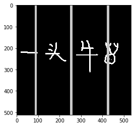
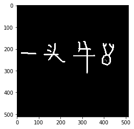
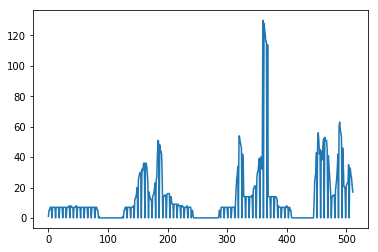

## 通过柱状统计进行字符分割-1Z实验室

## 概述
很多时候，我们要识别的字符，并不是完全独立的，它们之间可能有连笔，可能有接触点。 所以在数字识别或者整个字符识别领域，最难的难点就在于字符分割。阿凯会带大家了解字符分隔常用的几个经典算法， 包括直方图分割,CFS与传统滴水算法。
会分三节课依次讲解。本节，我们来了解一下最简单的直方图分割。




## 导入图片素材


```python
import cv2
import numpy as np
from matplotlib import pyplot as plt
```


```python
img = cv2.imread('demo.png', cv2.IMREAD_GRAYSCALE)

plt.imshow(img, cmap="gray")
plt.show()
```




## 垂直方向投影

我们需要在垂直方向上统计白色像素点的个数（非0区域的个数）。 
你可以使用for循环依次遍历， 但是这样比较低效， 你可以借助`numpy`的库函数，更加高效地实现。

为了实现这个目的，我们需要借助 `np.nonzero` 函数。


```python
np.nonzero(img != 0)
```


    (array([164, 164, 164, ..., 312, 312, 313]),
     array([307, 308, 309, ..., 323, 324, 322]))


`np.nonzero` 返回的是非0点地坐标， x轴坐标跟y坐标分别用两个`ndarray`存储。
因为opencv中图片ndrray的格式设定， 第一维度是y轴坐标， 第二维度是x坐标。
所以如果我们想获取图片中所有非零元素的x坐标， 需要这样
```python
np.nonzero(img != 0)[1]
```

接下来我们获取了所有非零元素的x坐标的集合，当然x坐标有重复，所以需要统计个数，每个x坐标出现了多少次。
为了滤波，我们可能需要把x坐标划分为若干个窗口(bins)，进行统计. numpy中的`np.histogram`可以实现这个功能。
np.histogram 返回元素， 第一个为**直方图 hist**， 第二个元素为**binEdge**

```python
len(binEdge) = len(hist) + 1
```

详细使用说明见文档： [numpy.histogram](https://docs.scipy.org/doc/numpy/reference/generated/numpy.histogram.html)


```python
xhist = np.nonzero(img != 0)[1]

# 获取图片高度与宽度
height, width = img.shape
# 定义统计窗口宽度
bin_width = 2
# 获取窗口数
bins= int(width / bin_width)

# 获取统计数组
np.histogram(np.int64(xhist), bins=bins)
```


    (array([  6,  12,  14,   7,  14,  14,   7,  14,  14,   7,  14,  14,   7,
             14,  14,   7,  14,  15,   7,  15,  14,   7,  14,  15,   7,  14,
             14,   7,  14,  14,   7,  14,  14,   7,  14,  14,   7,  14,  14,
              7,  14,  10,   1,   0,   0,   0,   0,   0,   0,   0,   0,   0,
              0,   0,   0,   0,   0,   0,   0,   0,   0,   0,   1,   5,  12,
             14,   7,  14,  14,   7,  14,  15,  12,  27,  36,  25,  56,  60,
             32,  64,  72,  36,  70,  53,  17,  27,  24,  14,  31,  42,  25,
             68, 101,  48,  88,  70,  14,  29,  30,  15,  32,  32,  14,  24,
             18,   9,  18,  18,   9,  17,  16,   8,  16,  14,   7,  14,  15,
              7,  14,  14,   5,   6,   0,   0,   0,   0,   0,   0,   0,   0,
              0,   0,   0,   0,   0,   0,   0,   0,   0,   0,   0,   0,   0,
              6,   5,  14,  14,   7,  14,  14,   7,  14,  14,   7,  14,  14,
              7,  27,  53,  34, 107,  98,  46,  79,  28,  14,  28,  28,  14,
             28,  28,  15,  38,  42,  21,  57,  66,  39,  80,  66, 130, 252,
            237, 116, 128,  28,  14,  28,  28,  14,  28,  27,  12,  15,  14,
              7,  14,  14,   7,  14,  15,   7,  14,  10,   1,   0,   0,   0,
              0,   0,   0,   0,   0,   0,   0,   0,   0,   0,   0,   0,   0,
              0,   0,  33,  57,  43, 106,  93,  45,  82,  87,  52, 104, 102,
             45,  76,  52,  15,  28,  30,  15,  40,  59,  42, 123, 114,  53,
             83,  41,  20,  43,  47,  35,  65,  54,  38]),
     array([ 18.        ,  19.66796875,  21.3359375 ,  23.00390625,
             24.671875  ,  26.33984375,  28.0078125 ,  29.67578125,
             31.34375   ,  33.01171875,  34.6796875 ,  36.34765625,
             38.015625  ,  39.68359375,  41.3515625 ,  43.01953125,
             44.6875    ,  46.35546875,  48.0234375 ,  49.69140625,
             51.359375  ,  53.02734375,  54.6953125 ,  56.36328125,
             58.03125   ,  59.69921875,  61.3671875 ,  63.03515625,
             64.703125  ,  66.37109375,  68.0390625 ,  69.70703125,
             71.375     ,  73.04296875,  74.7109375 ,  76.37890625,
             78.046875  ,  79.71484375,  81.3828125 ,  83.05078125,
             84.71875   ,  86.38671875,  88.0546875 ,  89.72265625,
             91.390625  ,  93.05859375,  94.7265625 ,  96.39453125,
             98.0625    ,  99.73046875, 101.3984375 , 103.06640625,
            104.734375  , 106.40234375, 108.0703125 , 109.73828125,
            111.40625   , 113.07421875, 114.7421875 , 116.41015625,
            118.078125  , 119.74609375, 121.4140625 , 123.08203125,
            124.75      , 126.41796875, 128.0859375 , 129.75390625,
            131.421875  , 133.08984375, 134.7578125 , 136.42578125,
            138.09375   , 139.76171875, 141.4296875 , 143.09765625,
            144.765625  , 146.43359375, 148.1015625 , 149.76953125,
            151.4375    , 153.10546875, 154.7734375 , 156.44140625,
            158.109375  , 159.77734375, 161.4453125 , 163.11328125,
            164.78125   , 166.44921875, 168.1171875 , 169.78515625,
            171.453125  , 173.12109375, 174.7890625 , 176.45703125,
            178.125     , 179.79296875, 181.4609375 , 183.12890625,
            184.796875  , 186.46484375, 188.1328125 , 189.80078125,
            191.46875   , 193.13671875, 194.8046875 , 196.47265625,
            198.140625  , 199.80859375, 201.4765625 , 203.14453125,
            204.8125    , 206.48046875, 208.1484375 , 209.81640625,
            211.484375  , 213.15234375, 214.8203125 , 216.48828125,
            218.15625   , 219.82421875, 221.4921875 , 223.16015625,
            224.828125  , 226.49609375, 228.1640625 , 229.83203125,
            231.5       , 233.16796875, 234.8359375 , 236.50390625,
            238.171875  , 239.83984375, 241.5078125 , 243.17578125,
            244.84375   , 246.51171875, 248.1796875 , 249.84765625,
            251.515625  , 253.18359375, 254.8515625 , 256.51953125,
            258.1875    , 259.85546875, 261.5234375 , 263.19140625,
            264.859375  , 266.52734375, 268.1953125 , 269.86328125,
            271.53125   , 273.19921875, 274.8671875 , 276.53515625,
            278.203125  , 279.87109375, 281.5390625 , 283.20703125,
            284.875     , 286.54296875, 288.2109375 , 289.87890625,
            291.546875  , 293.21484375, 294.8828125 , 296.55078125,
            298.21875   , 299.88671875, 301.5546875 , 303.22265625,
            304.890625  , 306.55859375, 308.2265625 , 309.89453125,
            311.5625    , 313.23046875, 314.8984375 , 316.56640625,
            318.234375  , 319.90234375, 321.5703125 , 323.23828125,
            324.90625   , 326.57421875, 328.2421875 , 329.91015625,
            331.578125  , 333.24609375, 334.9140625 , 336.58203125,
            338.25      , 339.91796875, 341.5859375 , 343.25390625,
            344.921875  , 346.58984375, 348.2578125 , 349.92578125,
            351.59375   , 353.26171875, 354.9296875 , 356.59765625,
            358.265625  , 359.93359375, 361.6015625 , 363.26953125,
            364.9375    , 366.60546875, 368.2734375 , 369.94140625,
            371.609375  , 373.27734375, 374.9453125 , 376.61328125,
            378.28125   , 379.94921875, 381.6171875 , 383.28515625,
            384.953125  , 386.62109375, 388.2890625 , 389.95703125,
            391.625     , 393.29296875, 394.9609375 , 396.62890625,
            398.296875  , 399.96484375, 401.6328125 , 403.30078125,
            404.96875   , 406.63671875, 408.3046875 , 409.97265625,
            411.640625  , 413.30859375, 414.9765625 , 416.64453125,
            418.3125    , 419.98046875, 421.6484375 , 423.31640625,
            424.984375  , 426.65234375, 428.3203125 , 429.98828125,
            431.65625   , 433.32421875, 434.9921875 , 436.66015625,
            438.328125  , 439.99609375, 441.6640625 , 443.33203125,
            445.        ]))


第一个元素是我们需要的垂直方向的投影


```python
np.histogram(np.int64(xhist), bins=bins)[0]
```


    array([  6,  12,  14,   7,  14,  14,   7,  14,  14,   7,  14,  14,   7,
            14,  14,   7,  14,  15,   7,  15,  14,   7,  14,  15,   7,  14,
            14,   7,  14,  14,   7,  14,  14,   7,  14,  14,   7,  14,  14,
             7,  14,  10,   1,   0,   0,   0,   0,   0,   0,   0,   0,   0,
             0,   0,   0,   0,   0,   0,   0,   0,   0,   0,   1,   5,  12,
            14,   7,  14,  14,   7,  14,  15,  12,  27,  36,  25,  56,  60,
            32,  64,  72,  36,  70,  53,  17,  27,  24,  14,  31,  42,  25,
            68, 101,  48,  88,  70,  14,  29,  30,  15,  32,  32,  14,  24,
            18,   9,  18,  18,   9,  17,  16,   8,  16,  14,   7,  14,  15,
             7,  14,  14,   5,   6,   0,   0,   0,   0,   0,   0,   0,   0,
             0,   0,   0,   0,   0,   0,   0,   0,   0,   0,   0,   0,   0,
             6,   5,  14,  14,   7,  14,  14,   7,  14,  14,   7,  14,  14,
             7,  27,  53,  34, 107,  98,  46,  79,  28,  14,  28,  28,  14,
            28,  28,  15,  38,  42,  21,  57,  66,  39,  80,  66, 130, 252,
           237, 116, 128,  28,  14,  28,  28,  14,  28,  27,  12,  15,  14,
             7,  14,  14,   7,  14,  15,   7,  14,  10,   1,   0,   0,   0,
             0,   0,   0,   0,   0,   0,   0,   0,   0,   0,   0,   0,   0,
             0,   0,  33,  57,  43, 106,  93,  45,  82,  87,  52, 104, 102,
            45,  76,  52,  15,  28,  30,  15,  40,  59,  42, 123, 114,  53,
            83,  41,  20,  43,  47,  35,  65,  54,  38])


```python
def binImgHist(img, bin_width=1, direction=1):
    '''
        二值化图像在y轴或者x轴方向的投影统计
    '''
    height, width = img.shape
    bins = None
    if direction == 0:
        # 在y轴方向上统计
        bins = int(height / bin_width)
    else:
        bins = int(width / bin_width)
    # 获取非零元素坐标
    nonzero_points = np.nonzero(img != 0)
    # 获取非零元素坐标中的x坐标集合或者y坐标集合
    nonzero_idx_x = nonzero_points[direction]
    #返回的统计直方图
    hist = np.histogram(np.int64(nonzero_idx_x), bins=bins)[0]
    
    return hist
```


```python
# 绘制x轴方向投影统计的折线图
xhist = binImgHist(img, bin_width=1, direction=1)
plt.plot(xhist)
plt.show()
# plt.savefig('digits_hist.png')
```





## 检索切割点

有了像素点统计之后， 我们就需要根据阈值将直方图划分为若干个片段， 从而获取到分割点。

你可以调整像素最小阈值`npixel_lowerb`的大小，获得不同的分割效果。


```python
def getSplitHistPoint(img, bin_width=1, direction=1, npixel_lowerb=1):
    '''
    获取直方图的切割点，用于切割图像
       img 二值化图
       bin_width: 窗口宽度
       direction: 方向
           0: 对
       npixel_lowerb 
    '''
    # 获得统计数组
    hist = binImgHist(img, bin_width=bin_width, direction=direction)
    # 根据是否大大于最小阈值，将hist转换为布尔类型的ndarray
    bin_hist = hist > npixel_lowerb
    
    # 初始化分割点
    split_pts = [0,]
    bins = len(hist)
    for bidx in range(1,bins):
        # 检索分割点， 并添加到分割点数组
        if bin_hist[bidx] == False and bin_hist[bidx-1] == True:
            split_pts.append(bidx)
    
    if split_pts[-1] != bins-1:
        # 添加最末尾的点
        split_pts.append(bins-1)
    
    # 对分割点，进行整体放缩， 因为统计窗口bin_width可能不为1
    split_pts = list(map(lambda x: x*bin_width,split_pts))
    return split_pts
    
    
```

获得到分割点后， 需要根据分割点，对图像进行分割


```python
def doSplitImgs(img, split_pts, direction=1):
    '''
    根据分割点对原图像进行分割
    '''
    n_pts = len(split_pts)
    digits = []
    for pidx in range(1,n_pts):
        # 分割坐标起始点
        startIdx = split_pts[pidx-1]
        # 分割坐标中止点
        endIdx = split_pts[pidx]
        
        if direction == 1:
            # x轴方向
            digits.append(img[:,startIdx:endIdx])
        else:
            # y轴方向
            digits.append(img[startIdx:endIdx,:])
            
    return digits

def displaySplitResult(digits):
    '''
        展示分割后的点集
        用一个图片展示， 中间插入间隔长条（crevice_bar）
    '''
    # 初始化画布
    canvas = digits[0]
    height, width = digits[0].shape
    # 定义分隔长条
    crevice_bar = np.ones((height, 10)) * 200
    
    n_digit = len(digits)
    for didx in range(1, n_digit):
        # 不断拼接新的数字跟分隔长条
        canvas = np.hstack((canvas,crevice_bar,digits[didx]))
    
    plt.clf()
    plt.imshow(canvas, cmap='gray')
    plt.show()
    # 保存图片
    cv2.imwrite('digit_split_by_hist.png', canvas)
    
split_pts = getSplitHistPoint(img, bin_width=6, direction=1, npixel_lowerb=25)
digits = doSplitImgs(img, split_pts=split_pts, direction=1)
displaySplitResult(digits)
```


## 直方图分割算法总结

直方图分割法比较简单粗暴，但是也有其自身存在的问题。

1. 直方图分割算法比较简单暴力。 分割线必须竖直分割， 对于有一定倾斜角度的字符，它们的直方图就会连在一起，很难分割。
2. 同时如果线条简单而且细的笔画，也很容易被割裂， 例如上图中的凡字。
3. 如果两个字符很紧密的话， 同样也会无法识别跟分割。
4. 对于汉字，左右分布结构， 左边的偏旁也容易跟字符主体分割开来。

总之，直方图分割法，应用场景比较局限，只适用于字符内部紧凑，字间距较大的情况。
