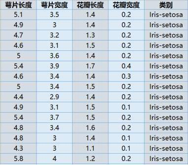

# KNN最近邻算法详解-1Z实验室 


## 0. 概要

学完本课程，你将获得如下收益

* 了解KNN的核心思想
* 学会数据预处理中的**归一化方法**
* 了解**欧式距离**计算公式与numpy实现
* 从**底层实现KNN**算法


## 1. 效果展示

这是利用iris鸢尾花数据集，使用KNN模型进行分类的效果．


代码请从本文末尾**附录A**中获取.


##2. KNN算法原理-近朱者赤 近墨者黑

古语**近朱者赤，近墨者黑**， 讲述的就是K最近邻算法（k-NearestNeighbor，KNN）的核心思想。

> 故近朱者赤，近墨者黑；声和则响清，形正则影直。 晋·傅玄《太子少傅箴》，靠着朱砂的变红，靠着墨的变黑。比喻接近好人可以使人变好，接近坏人可以使人变坏。指客观环境对人有很大影响。
>
> --摘自百度百科


KNN根据周边相邻近的元素的分类， 来判别当前这个元素的类别。 举个例子，请你判别下图问号区域的类别，是红色还是绿色呢？ 

> ps: 我们这里只是抽象的在2D平面绘制了一些点，类别也是抽象的。


不需要深思熟虑， 凭我们的直觉， 我们不难得出一个结论：该点是红色的， 因为跟它最相近的元素是红色的。**注意：我们这篇文章里提到的距离计算方式，采用的都是欧式距离。**

同样，给定另外一个位置点(见下图问号区域)，该点是红色还是绿色呢？ 


类似的，我们可以得出该点为绿色正方形对应的类别。那么，我们能不能仅仅通过寻找离他最近的那单个元素，来判别其属性呢？ 请看下面这个例子：

恐怕，我们看到这个就很难直观的得出结论了．


另外一个极端的例子是这样的：


未知点最邻近的区域是绿色矩形，但是周边都是红色三角形， 如果仅仅通过最近未知点最近的单一条件，来判断，我们就会受噪声的干扰较大。所以另外一个淳朴的想法诞生了， 我们能不能**综合周边K个邻近点的信息，来判别该点所属的类别**呢？ 统计K个点，对他们所属类别统计，选取数量最多的类，作为该点的类。


> 图片来自与 西瓜书(机器学习-周志华) P225

k的值，理论上我们可以取任意的数值， 如果k取的很小，ｋ最小为1,　可能会出现我们上面讲的极端情况。 如果k取很大的话， 例如夸张一点跟数据集总数相近的时候,　就没啥实际的意义了， 模型就变成了统计哪个类别的点数量比较多，就标注为什么类别，因此距离产生的影响就会变的很弱。

**KNN中的K，　属于超参数， 需要自己设定， 自己寻找最合适的取值。** 


## 3. 鸢尾花数据集

我们讲解KNN算法需要找到简单的合适的数据集，阿凯选取鸢尾花作为演示数据集．


鸢尾花数据是一个简易有趣的数据集。这个数据集来源于科学家在一岛上找到一种花的三种不同亚类别，分别叫做**iris setosa, iris versicolor,iris virginica**。但是这三个种类并不是很好分辩，所以他们又从**花萼长度(sepal length)，花萼宽度(sepal width)，花瓣长度(petal length)，花瓣宽度(petal width) **这四个角度测量不同的种类用于定量分析。基于这四个特征，这些数据成了一个**多变量分析的数据集**。在python的机器学习工具包sklearn中预置了鸢尾花（iris）的数据集， 我们可以直接从**datasets**导入， 每种类型的鸢尾花各有50个样本，target（目标分类）编号分别为0,1,2



```python
# 导入数据库
from sklearn import datasets
# 从数据库中载入iris样本
iris = datasets.load_iris()

X = iris.data
y = iris.target
```

```python
# 打印前10组特征
X[:10]
```

___

> 四列分别代表上述的四种特征：花萼长度(sepal length)，花萼宽度(sepal width)，花瓣长度(petal length)，花瓣宽度(petal width) 

```
array([[ 5.1,  3.5,  1.4,  0.2],
       [ 4.9,  3. ,  1.4,  0.2],
       [ 4.7,  3.2,  1.3,  0.2],
       [ 4.6,  3.1,  1.5,  0.2],
       [ 5. ,  3.6,  1.4,  0.2],
       [ 5.4,  3.9,  1.7,  0.4],
       [ 4.6,  3.4,  1.4,  0.3],
       [ 5. ,  3.4,  1.5,  0.2],
       [ 4.4,  2.9,  1.4,  0.2],
       [ 4.9,  3.1,  1.5,  0.1]])
```


```python
# 打印前10个数据的标签
y[:10]
```

___

> 因为是按顺序排列的，所以前10个都为编号为0的鸢尾花类型。

```
array([0, 0, 0, 0, 0, 0, 0, 0, 0, 0])
```


为了讲解KNN算法， 我们先从最简单的2D数据开始讲解。所以我们可以从iris数据集中选取两组特征值，例如花萼长度(sepal length)，花萼宽度(sepal width）。因为只选取了其中的两维数据， 信息肯定是丢失的，所以不必纠结与最后的准确率。

```python
data = X[:,:2]
data[:10]
```

------

```
array([[ 5.1,  3.5],
       [ 4.9,  3. ],
       [ 4.7,  3.2],
       [ 4.6,  3.1],
       [ 5. ,  3.6],
       [ 5.4,  3.9],
       [ 4.6,  3.4],
       [ 5. ,  3.4],
       [ 4.4,  2.9],
       [ 4.9,  3.1]])
```


```python
# 打乱排序
import numpy as np
n_sample = len(data)
# 初始化排序
idxs = np.arange(n_sample)
# 打乱排序
np.random.shuffle(idxs)

data = data[idxs]
target = y[idxs]
```

```python
target
```

------

> 可以从鸢尾花标签（target）数据中看到，已经被随机打乱顺序。

```
array([0, 2, 1, 2, 0, 2, 0, 2, 2, 0, 2, 1, 0, 2, 2, 2, 1, 1, 2, 0, 0, 2, 1,
       0, 2, 1, 1, 2, 0, 0, 2, 1, 1, 0, 2, 1, 0, 0, 1, 2, 2, 0, 2, 2, 2, 1,
       1, 1, 2, 2, 1, 1, 0, 0, 0, 2, 0, 0, 1, 2, 0, 0, 1, 2, 2, 1, 1, 0, 1,
       0, 0, 0, 2, 0, 1, 0, 0, 1, 0, 1, 1, 0, 1, 0, 2, 2, 0, 1, 2, 1, 0, 1,
       1, 1, 0, 2, 0, 0, 2, 2, 2, 0, 1, 2, 0, 2, 2, 0, 1, 0, 1, 2, 1, 2, 0,
       0, 2, 1, 1, 1, 1, 0, 0, 2, 1, 2, 1, 2, 2, 0, 2, 1, 1, 1, 0, 2, 0, 2,
       1, 0, 2, 0, 1, 1, 0, 1, 2, 1, 1, 2])
```


```python
from matplotlib import pyplot as plt

def drawData(data, target):
    targetColorDict = {
        0: 'red',
        1: 'green',
        2: 'blue'
    }

    for t,color in targetColorDict.items():
        idxs = np.argwhere(target == t)
        idxs.resize(len(idxs))
        plt.scatter(data[idxs][:,0],data[idxs][:,1],s=25,marker='o', c=targetColorDict[t])

    plt.show()
    
drawData(data, target)
```

> 下图的红点，绿点跟蓝点分别代表三种鸢尾花。可以看到红色相对于比较独立，蓝色跟绿色有一定程度的耦合。


## 4. 数据归一化

在进行距离计算之前，我们需要做进一步的数据预处理的工作。 如果维度之间的数值的差别很大的话， 不能直接进行距离计算，例如这样的

$$distance = \sqrt{(0-67)^2 + (20000 - 32000)^2 + (1.1 - 0.1)^2}$$

需要各个特征（Feature）列其进归一化（normalized）， 将数值范围放缩到0-1之间。

**归一化公式**

$$newValue = (oldValue - minValue) / (maxValue - minValue)$$

* `oldValue` 原来的属性值
* `minValue` 原来特征列中的最小值
* `maxValue` 原来特征列中的最大值
* `newValue` 归一化的取值， 数值范围在0-1之间。


```python
def Normalize(data):
    '''
    对数据进行归一化处理
    '''
    n_dimension = len(data[0])
    new_data = np.copy(data)
    
    for d_idx in range(n_dimension):
        minValue = np.min(data[:,d_idx])
        maxValue = np.max(data[:,d_idx])
        new_data[:,d_idx] = (data[:,d_idx] - minValue)/(maxValue - minValue)
    return new_data

data = Normalize(data)
drawData(data, target)
```


## 5. 距离计算公式 - 欧式距离

在KNN中，重要的一步就是要计算元素与元素之间的距离。

实际上，距离计算的方法有很多种，例如欧式距离，汉明距离等等，详细的距离计算方法，大家可以参考一下博客[各种距离算法](http://blog.csdn.net/a_12_123_1234_12345/article/details/78857062). 这里我们只讲解欧式距离。
实际上，我们在平面几何中， 计算距离采用的就是欧式距离。


在2D平面上， 点$(x_1, y_1), (x_2, y_2)$之间的距离计算公式为：

 

$$d = \sqrt{(x_1 - x_2)^2 + (y_1 - y_2)^2}$$


```python
def EuclideanDistance(data, vect):
    '''
    计算一个点与其他点集的距离，输出一个距离列表
    '''
    return np.sqrt(((data-vect)**2).sum(axis=1))

EuclideanDistance(data, np.array([0.5, 0.5]))
```

------

> 打印 (0.5, 0.5) 距离其他归一化后数据点的距离数组（ndarray）

```
array([ 0.20833333,  0.13678969,  0.16197089,  0.17179607,  0.30460711,
        0.13888889,  0.29000851,  0.29000851,  0.33592741,  0.50689688,
        0.39771725,  0.41036908,  0.45069391,  0.08333333,  0.47466687,
        0.22438187,  0.58597286,  0.2003084 ,  0.17179607,  0.34359214,
        0.30838338,  0.186339  ,  0.2003084 ,  0.38888889,  0.21561354,
        0.12804923,  0.25609846,  0.25      ,  0.48848626,  0.37060178,
        0.35600016,  0.17179607,  0.41759157,  0.3167154 ,  0.13888889,
        0.22438187,  0.33592741,  0.51219691,  0.32542707,  0.16896563,
        0.21154925,  0.47222222,  0.17179607,  0.22609473,  0.08784105,
        0.21154925,  0.1001542 ,  0.06944444,  0.50993222,  0.30555556,
        0.22438187,  0.12804923,  0.37371178,  0.28088539,  0.30460711,
        0.06944444,  0.30555556,  0.3167154 ,  0.08784105,  0.50993222,
        0.37060178,  0.30460711,  0.33592741,  0.22222222,  0.1001542 ,
        0.372678  ,  0.17179607,  0.37371178,  0.21017703,  0.3167154 ,
        0.37060178,  0.37371178,  0.34805456,  0.44876373,  0.18685589,
        0.35053971,  0.33592741,  0.41759157,  0.2795085 ,  0.08333333,
        0.25      ,  0.37060178,  0.26352314,  0.34359214,  0.44292274,
        0.55901699,  0.27357938,  0.40277778,  0.3167154 ,  0.372678  ,
        0.36350701,  0.32304732,  0.16197089,  0.37909289,  0.38888889,
        0.22438187,  0.26352314,  0.33013512,  0.17568209,  0.45218946,
        0.0931695 ,  0.42491829,  0.16666667,  0.22609473,  0.35053971,
        0.08784105,  0.42491829,  0.21154925,  0.18685589,  0.44876373,
        0.13888889,  0.31211396,  0.2003084 ,  0.29691053,  0.34722222,
        0.33592741,  0.21695138,  0.27357938,  0.186339  ,  0.16666667,
        0.08333333,  0.41874482,  0.21154925,  0.22438187,  0.22609473,
        0.1001542 ,  0.05555556,  0.11111111,  0.41759157,  0.41666667,
        0.13888889,  0.125     ,  0.4837243 ,  0.16197089,  0.47951879,
        0.186339  ,  0.34805456,  0.186339  ,  0.29691053,  0.33013512,
        0.19444444,  0.58151171,  0.30046261,  0.1502313 ,  0.28497617,
        0.16724437,  0.186339  ,  0.47140452,  0.25038551,  0.08333333])
```


## 6. K最近邻算法的实现

为了讲解KNN，同时也因为KNN模型足够简单，所以阿凯打算先讲解如何自己动手DIY KNN算法。
前面讲解了获取一个点距离数据集的所有距离的集合，所以在KNN函数中，需要做的就是需要提取前K个最小距离的数据并统计他们所属的类，最后输出最多的类。

```python
# 拟定一个测试点 坐标是0.5 0.5
vect = np.array([0.5, 0.5])
# K设定为5
K = 5
# 获取距离列表
distance = EuclideanDistance(data, vect)
```

```python
# 获取排序从小到大对应的编号 并截取前K个index
kn_idxs = distance.argsort()[:K]
kn_idxs
```

> 这里获取的是从小到大排序 前K个元素的**编号 (index)**

```
array([126,  55,  47, 120,  79])
```

接下来，需要将index变成对应的**标签（target）**数据。

```python
# 获取前K个邻居的标签
kn_labels = target[kn_idxs]

print(kn_labels)
```

------

```
[1 2 1 1 1]
```


然后需要对前K个元素所属的类别进行**统计**, 你可以自己实现统计计数的功能（比如使用字典dict，或者数组list），也可以借用`collections.Counter`函数。

```python
import collections
# 对标签进行统计
kn_labels_stat = dict(collections.Counter(kn_labels))
print(kn_labels_stat)
```

------

```
{1: 4, 2: 1}
```

获取数量最多的标签

```python
# 获取数量最多的标签
predict = max(kn_labels_stat, key=lambda x: kn_labels_stat[x])
print(predict)
```

> 最终发现类别1的计数最多，所以根据KNN的规则，我们认定该点的类别为1

```
1
```


将上述的过程，封装在`KNN`函数中．

```python
def KNN(data, vect, K=3):
    '''
    K 邻近算法的实现
    '''
    distance = EuclideanDistance(data, vect)
    kn_idxs = distance.argsort()[:K]
    # 获取前K个邻居的标签
    kn_labels = target[kn_idxs]
    # 对标签进行统计
    kn_labels_stat = dict(collections.Counter(kn_labels))
    # 获取数量最高的标签
    predict = max(kn_labels_stat, key=lambda x: kn_labels_stat[x])
    return predict
```

使用我们DIY的`KNN`函数重新实现上述过程：
```python
# 拟定一个测试点 坐标是0.5 0.5
vect = np.array([0.5, 0.5])
# K设定为5
K = 5
KNN(data, vect, K)
```

------

```
1
```


## 7. 预测效果检验

划分训练集跟测试集, 使用80%的数据作为训练集， 剩下的20%作为测试集。

**注意：KNN没有预先训练模型的过程**， 这个模型比较**懒**, 每次判断一个点类型的时候，是将这个点跟训练集中的每个样本一一比较，然后选取前K个比较邻近的。 类似这种的学习方式被称之为**Lazy Learning 懒式学习** 

> '有点像是平时不努力学习功课，到了考前才开始临时抱佛脚的感觉。'

```python
# 训练集
X_train = data[:120]
y_train = target[:120]
# 测试集
X_test = data[120:]
y_test = target[120:]

def evaluateModel(X_train, y_train, X_test, y_test, K=1):
    y_predict = np.ones_like(y_test)
    n_test = len(y_test)
    
    for idx in range(n_test):
        vect = X_test[idx]
        predict = KNN(data, vect, K)
        y_predict[idx] = predict
    
    # 准确率
    accuracy = np.count_nonzero(y_predict == y_test) / n_test
    return accuracy


accuracy = evaluateModel(X_train,y_train, X_test, y_test,K=5)
print("准确率：　%.2f"%(accuracy))
```

------

```
准确率：　0.80
```


## 8. 可视化

我们可以遍历画面中的所有点，把点集都放在KNN模型中进行预测，最后得到一张可视化的模型，可以观察到每种类别的**势力范围**。 

**注意：此过程非常耗时，需要耐心等待， 这也是KNN的缺点。**

```python
import itertools


targetColorDict = {
    0: 'red',
    1: 'green',
    2: 'blue'
}

# 绘制预测点
for pt in itertools.product(np.arange(0,1,0.02), np.arange(0,1,0.02)):
    t = KNN(data, np.array([pt[0], pt[1]]), K)
    plt.scatter(np.array([pt[0]]),np.array([pt[1]]),s=25,marker='o', c=targetColorDict[t],alpha=0.2)

# 绘制数据点
for t,color in targetColorDict.items():
    idxs = np.argwhere(target == t)
    idxs.resize(len(idxs))
    plt.scatter(data[idxs][:,0],data[idxs][:,1],s=25,marker='o', c=targetColorDict[t])


plt.show()    
```


## 9. 引入四维数据

之前我们只采用了两维数据，现在，我们可以引入四维数据：　花萼长度(sepal length)，花萼宽度(sepal width)，花瓣长度(petal length)，花瓣宽度(petal width)

```python
X = iris.data
y = iris.target

n_sample = len(y)

# 初始化排序
idxs = np.arange(n_sample)
# 打乱排序
np.random.shuffle(idxs)

data = data[idxs]
target = y[idxs]

# 训练集
X_train = data[:120]
y_train = target[:120]
# 测试集
X_test = data[120:]
y_test = target[120:]
```

```python
accuracy = evaluateModel(X_train,y_train, X_test, y_test,K=1)
print("准确率：　%.2f"%(accuracy))
```

> 准确率跟之前只参考两个维度的KNN模型相比，有7%的提升。

```
准确率：　0.87
```


然后我们尝试不同的K值，遍历一下，看具体的表现如何

```python
k_list = np.arange(1, 13, 2)
result = []
for K in k_list:
    accuracy = evaluateModel(X_train,y_train, X_test, y_test,K=K)
    result.append(accuracy)
    print('K=  %d; Accuracy: %.2f'%(K, accuracy))

plt.xticks(k_list)
plt.xlim(1, 11)
plt.plot(k_list,result)
plt.show()
```

------

```
K=  1; Accuracy: 0.87
K=  3; Accuracy: 0.87
K=  5; Accuracy: 0.73
K=  7; Accuracy: 0.70
K=  9; Accuracy: 0.50
K=  11; Accuracy: 0.40
```


通过对上图中数据的分析，针对鸢尾花数据集，K=1(或K=3)的时候，准确率最高．

> PS: 其实机器学习的准确率并不是唯一的评价模型的标准，只不过阿凯在教程里目前只提到了这一种，在之后的学习过程中，我们会逐渐提到更多的模型评价指标，例如roc等．


## 10. 总结

**KNN优点**
原理比较简单，无需参数估计，没有训练过程，针对多分类问题比较好．

**KNN缺点**
之前提到过，KNN算法属于惰性学习，每次输入样本的时候，需要匹配所有．因此如果样本量很多的话，计算量就会非常高.


##  11. 附录

### 附录A-源码 `KNN.py`

```python
# -*- coding:utf-8 -*-
# 导入数据库
from sklearn import datasets
import numpy as np
from matplotlib import pyplot as plt
import collections
import itertools


def drawData(data, target):
    '''
    绘制数据集
    '''
    targetColorDict = {
        0: 'red',
        1: 'green',
        2: 'blue'
    }

    for t,color in targetColorDict.items():
        idxs = np.argwhere(target == t)
        idxs.resize(len(idxs))
        plt.scatter(data[idxs][:,0],data[idxs][:,1],s=25,marker='o', c=targetColorDict[t])

    plt.show()

def Normalize(data):
    '''
    对数据进行归一化处理
    '''
    n_dimension = len(data[0])
    new_data = np.copy(data)
    
    for d_idx in range(n_dimension):
        minValue = np.min(data[:,d_idx])
        maxValue = np.max(data[:,d_idx])
        new_data[:,d_idx] = (data[:,d_idx] - minValue)/(maxValue - minValue)
    return new_data

def EuclideanDistance(data, vect):
    '''
    计算一个点与其他点集的距离，输出一个距离列表
    '''
    return np.sqrt(((data-vect)**2).sum(axis=1))


def KNN(data, vect, K=3):
    '''
    K 邻近算法的实现
    '''
    distance = EuclideanDistance(data, vect)
    kn_idxs = distance.argsort()[:K]
    # 获取前K个邻居的标签
    kn_labels = target[kn_idxs]
    # 对标签进行统计
    kn_labels_stat = dict(collections.Counter(kn_labels))
    # 获取数量最高的标签
    predict = max(kn_labels_stat, key=lambda x: kn_labels_stat[x])
    return predict


# 从数据库中载入iris样本
iris = datasets.load_iris()

X = iris.data
y = iris.target


# 打乱排序

data = X[:,:2] # 只提取前两维数据
n_sample = len(data)
idxs = np.arange(n_sample) # 初始化排序
np.random.shuffle(idxs) # 打乱排序

data = data[idxs]
target = y[idxs]


data = Normalize(data)
drawData(data, target)


targetColorDict = {
    0: 'red',
    1: 'green',
    2: 'blue'
}

K = 3

print('下方操作非常耗时，请耐心等待')
# 绘制预测点
for pt in itertools.product(np.arange(0,1,0.02), np.arange(0,1,0.02)):
    t = KNN(data, np.array([pt[0], pt[1]]), K)
    plt.scatter(np.array([pt[0]]),np.array([pt[1]]),s=25,marker='o', c=targetColorDict[t],alpha=0.2)

# 绘制数据点
for t,color in targetColorDict.items():
    idxs = np.argwhere(target == t)
    idxs.resize(len(idxs))
    plt.scatter(data[idxs][:,0],data[idxs][:,1],s=25,marker='o', c=targetColorDict[t])


plt.show()   

```

