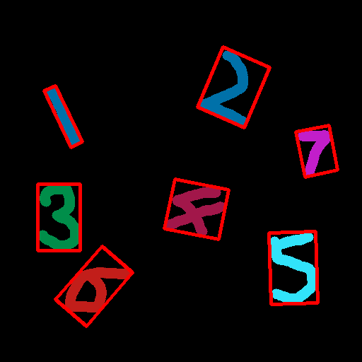
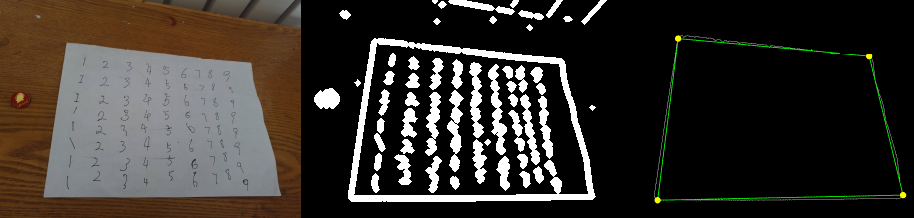
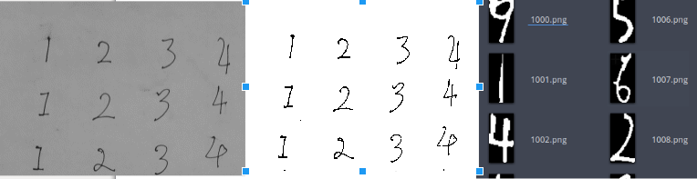
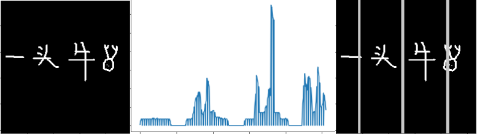
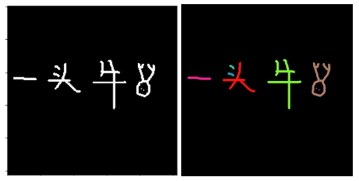
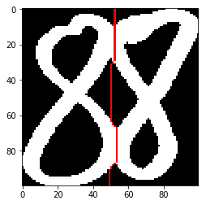
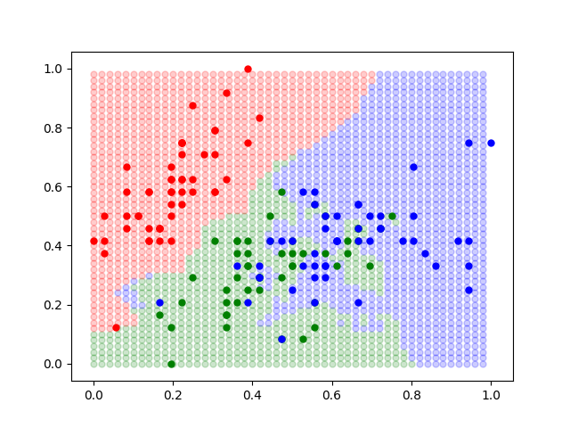

# 手写数字识别主题课程-1Z实验室

作者： 阿凯

1Z实验室出品 **Make Things Easy**

## 导言

很多计算机视觉的教程，或者是机器学习的教程， 手写数字识别往往被用来当作第一个项目讲解。
但是往往大家采用的都是现成的数据集，例如`MINST`。 而事实上，在整个项目中，最复杂最困难的就是自己采集样本， 使用OpenCV对样本进行数据预处理，采用现成的数据集，巧妙的避开了这个学习机会。
所以本套教程主要侧重的是对手写数字样本的采集与预处理部分， 主要包括**图像透视变换，二值化，联通阈检索，字符分割**。

## 目录

[利用机器学习进行手写字体识别的过程解析](./01.利用机器学习进行手写字体识别的过程解析/利用机器学习进行手写字体识别的过程解析-1Z实验室.md)

[寻找A4纸所在的四边形区域与变形](./02.寻找A4纸所在的四边形区域与变形/寻找A4纸所在的四边形区域与变形-1Z实验室.md)

[A4纸区域的图像二值化与数字提取](./03.A4纸区域的图像二值化与数字提取/A4纸区域的图像二值化与数字提取.md)

[通过柱状统计进行字符分割](./04.通过柱状统计进行字符分割/通过柱状统计进行字符分割-1Z实验室.md)

[CFS字符分割](./05.通过CFS进行字符分割/CFS字符分割-1Z实验室.md)

[传统滴水算法-字符分割](./06.通过传统滴水算法进行字符分割/传统滴水算法-字符分割-1Z实验室.md)

[KNN最近邻算法](./07.KNN最近邻算法/KNN最近邻算法-1Z实验室.md)

## 课程推广

加入1Z实验室交流群，学习之路不再孤单。
1ZLAB：**Make Things Easy**
